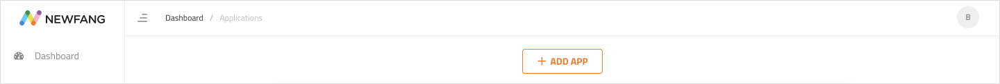

# Getting started


While in private alpha, you should expect bugs and us hard at work fixing them. Server restarts, purging and data loss are commonplace so  
- DO NOT use in production or in critical dev environments.  
- DO NOT upload any critical files  
- DO NOT share an information like passwords, payment details etc... on any part of the system.



We are in private alpha and have a waitlist of developers who want to try us out. During our alpha, all uploads and downloads are free of cost.


To start using Newfang, use the sign up form on our [website](https://newfang.io) or write to us on [hello@newfang.io](mailto:hello@newfang.io)

We will then reach out to you and send you your login credentials for our [developer portal](https://developer.newfang.io).

One logged in, the first thing you will need to do is create your app for which you want to generate and download SDKs.

* First, click on the **Applications** menu option in the side-bar.

* When on the Applications page, click on the **ADD APP** button.

* In the **Add Application** modal that pops up, put in a suitable **App Name** and select a **Configuration** for your app. Evaluate your config details based on the 3 parameters shown and click the **ADD APP** button

* Once successfully added, you should see your app in the **Applications Table** below the **ADD APP** button.

* You can now download the SDK of your choice by clicking on the **DESKTOP** or **WEB** buttons under the **Download SDK** column of the **Applications Table**.

